# PolyglotCLI

A modern, web-based translation application built with ASP.NET Core Blazor (interactive server-side) and .NET 10. It translates PDF and other documents page-by-page, supporting direct text extraction or image-rendering with OCR using vision-enabled local or cloud-based LLMs (such as Qwen2.5-VL, Llama 3.2 Vision, Gemini, or Ollama).

Translations are processed incrementally (page-by-page) and appended immediately to the output files, keeping memory usage minimal.

---

## Features

- **Single Responsibility Principle (SRP)**: Highly modular design separating core translation engine, clients, and presentation layer.
- **Modern Web Interface**: Built with Blazor and Radzen components, providing a dark-themed responsive dashboard, real-time logs, live preview/editing of translations, and a prompt manager.
- **Multiple Processing Modes**:
  - `text`: Extracts text directly from selectable PDF and text-based documents.
  - `image`: Renders document pages as images and performs OCR using vision models.
- **Incremental File Generation**: Appends translated content in real-time, preventing large memory footprints.
- **Centralized Configuration**: Settings managed via `config.json` with multi-provider credentials support.
- **External Markdown Prompts**: System prompts for OCR, translation, and reviews are loaded dynamically from the `prompts` folder.

---

## Architecture & Code Structure

The solution is divided into two main projects:

### 1. [PolyglotCLI.core](PolyglotCLI.core/) (Core Business Logic)
- [Clients/](PolyglotCLI.core/Clients/): Multi-provider HTTP client wrappers (Ollama, LM Studio, Gemini, Anthropic, etc.).
- [Configuration/AppConfig.cs](PolyglotCLI.core/Configuration/AppConfig.cs): Configuration parser and state persistence.
- [Services/TranslationOrchestrator.cs](PolyglotCLI.core/Services/TranslationOrchestrator.cs): Main pipeline coordinating extraction, OCR, translation, and validation.
- [Services/IDocumentExtractor.cs](PolyglotCLI.core/Services/IDocumentExtractor.cs): Unified interface for extracting document content (PDF, DOCX, DOC, ODT, images, plain text).
- [Services/OcrService.cs](PolyglotCLI.core/Services/OcrService.cs): Manages the OCR request pipeline.
- [Services/TranslatorService.cs](PolyglotCLI.core/Services/TranslatorService.cs): Orchestrates LLM prompt assembly and calls translation providers.

### 2. [PolyglotCLI.web](PolyglotCLI.web/) (Web Presentation & Dashboard)
- [Program.cs](PolyglotCLI.web/Program.cs): Startup configurations and background services.
- [Components/Pages/Home.razor](PolyglotCLI.web/Components/Pages/Home.razor): Main translation dashboard.
- [Components/Pages/History.razor](PolyglotCLI.web/Components/Pages/History.razor): Translation work viewer, editor, and page verifier.
- [Components/Pages/Config.razor](PolyglotCLI.web/Components/Pages/Config.razor): Central settings panel for APIs, LLM models, prompts, and chunking configurations.

---

## Workflow Diagram

A clean, compact, serpentine workflow diagram is available as an interactive Excalidraw file:

- **Interactive File:** [architecture.excalidraw](docs\architecture.excalidraw) (Open it in your editor or import it at [excalidraw.com](https://excalidraw.com) to view, edit, or export).
- **Static Preview:** Export it to `architecture.svg` or `architecture.png` to display it directly:

```mermaid
graph LR
    A[Start Application] --> B{Load Config & Prompts}
    B --> C{Check Existing Output Files?}
    C -- Yes --> D[Parse Markdown Pages to RAM Cache]
    C -- No --> E[Initialize RAM Cache empty]
    D --> F[Phase 1: Text Extraction & OCR]
    E --> F
    F --> G{Page cached on disk?}
    G -- Yes --> H[Skip Extraction, Load OCR text from cache]
    G -- No --> I[Run Extraction / OCR]
    I --> J[Save extracted OCR text to disk immediately]
    H --> K[Phase 2: Model Transition]
    J --> K
    K --> L[Phase 3: Translation & Review]
    L --> M{Page translated on disk?}
    M -- Yes --> N[Skip Translation, Load from cache]
    M -- No --> O[Run Translation & Review]
    O --> P[Save translated page to disk immediately]
    N --> Q[Loop Next Page / Finish]
    P --> Q
```


<details>
<summary><b>View Original Mermaid Diagram Source</b></summary>



</details>

---

## Prerequisites

1. **.NET 10 SDK** installed on your system.
2. **LM Studio** installed and running.
   - Start the **Local Server** on LM Studio (usually at `http://localhost:1234` or `http://172.22.144.1:1234`).
   - Load a text model (e.g. `qwen3.5-9b` or `ministral-3-3b`) for text mode.
   - Load a vision model (e.g. `qwen2.5-vl-7b` or `llama-3.2-11b-vision-instruct`) for image OCR mode.

---

## Configuration (`config.json`)

Settings are loaded from `config.json` in the root folder. You can edit this file to match your LM Studio setup:

```json
{
  "ApiUrl": "http://172.22.144.1:1234/v1",
  "DefaultModel": "qwen/qwen3.5-9b",
  "DefaultVisionModel": "qwen/qwen3.5-9b"
}
```

---

## How to Use

To run the application, launch the Web project:

```powershell
dotnet run --project PolyglotCLI.web
```

Once started, navigate to the local server URL indicated in your console output (typically `http://localhost:5000` or `https://localhost:5001`).

### Web Interface Sections

1. **Dashboard (Home)**:
   - **File Upload / Directory Scanning**: Scan a folder or specify documents to translate.
   - **Execution Settings**: Toggle document extraction, AI translation, and post-translation reviews. Toggle debug mode (processes only the first 2 pages) to quickly test the pipeline.
   - **Real-Time Log Console**: Monitor extraction steps, LLM prompts/responses, and token usage, with toggleable auto-scrolling.

2. **Job History**:
   - **Workspace Viewer**: Review all active and completed translation jobs.
   - **Page Verifier**: Compare original document page images with the cleaned OCR output on a tabbed split-pane view, and edit/fix the translated text or view the model's reasoning/thought processes (`<think>` blocks).
   - **Exporting**: Force re-export of translated documents to Markdown, Word (DOCX), or PDF formats.
   - **Maintenance**: Safely delete processed job workspaces.

3. **Settings Panel**:
   - **Providers & Models**: Configure API endpoints, models, temperatures, and keys for Ollama, LM Studio, OpenAI, Gemini, Anthropic, etc.
   - **Prompt Manager**: Fine-tune system prompts directly from the browser for OCR extraction, translation, and reviews.
   - **Formatting & Ranges**: Manage input file extensions and output directories.

---

## License

This project is licensed under the [MIT License](LICENSE).
