# Original Text of: README.md
- **Language:** Original
- **Date:** 2026-07-10 09:19:57
- - -

## Page 1
# PolyglotCLI

A lightweight, modern C# console application built with .NET 10 to translate PDF documents page-by-page. It supports extracting text directly from selectable PDF files or rendering pages into images to perform OCR using vision-enabled local LLMs (like Qwen2.5-VL or Llama 3.2 Vision) inside **LM Studio**.

Translations are processed incrementally (page-by-page) and appended immediately to a Markdown output file, minimizing memory usage.

---

## Features

- **Single Responsibility Principle (SRP)**: Clean codebase where each file governs a single component.
- **Two Processing Modes**:
  - `text`: Extracts text directly from selectable PDF pages.
  - `image`: Renders PDF pages to PNG and performs OCR via LM Studio's Vision API.
- **Incremental Markdown Generation**: Translates page-by-page and appends to the markdown file in real-time, preventing large memory footprints.
- **JSON Configuration**: Configured entirely via `config.json` with CLI overrides.
- **External Markdown Prompts**: System prompts for OCR and Translation are located in the `prompts` folder for easy adjustments.

---

## Architecture & Code Structure

- [Program.cs](Program.cs): Main orchestration flow.
- [Configuration/CommandLineOptions.cs](Configuration/CommandLineOptions.cs): Command-line argument parsing and validation.
- [Configuration/AppConfig.cs](Configuration/AppConfig.cs): Configuration parser for `config.json`.
- [Services/PromptLoader.cs](Services/PromptLoader.cs): Service to load markdown prompt templates.
- [Services/PdfTextExtractor.cs](Services/PdfTextExtractor.cs): Handles direct text extraction via `PdfPig`.
- [Services/PdfPageRenderer.cs](Services/PdfPageRenderer.cs): Renders PDF pages into PNG bytes via `PDFtoImage` / `SkiaSharp`.
- [Clients/LmStudioClient.cs](Clients/LmStudioClient.cs): HTTP client for OpenAI-compatible REST completions and vision API.
- [Services/OcrService.cs](Services/OcrService.cs): Manages OCR workflow with local Vision LLMs.
- [Services/TranslatorService.cs](Services/TranslatorService.cs): Manages text translation to target languages.
- [Services/MarkdownWriter.cs](Services/MarkdownWriter.cs): Handles incremental appending of pages to the markdown file.

---

## Workflow Diagram

A clean, compact, serpentine workflow diagram is available as an interactive Excalidraw file:

- **Interactive File:** [architecture.excalidraw](docs\architecture.excalidraw) (Open it in your editor or import it at [excalidraw.com](https://excalidraw.com) to view, edit, or export).
- **Static Preview:** Export it to `architecture.svg` or `architecture.png` to display it directly:

```mermaid
graph LR
    A[Start Application] --> B{Load Config & Prompts}
    B --> C{Check Existing Output Files?}
    C -- Yes --> D[Parse Markdown Pages to RAM Cache]
    C -- No --> E[Initialize RAM Cache empty]
    D --> F[Phase 1: Text Extraction & OCR]
    E --> F
    F --> G{Page cached on disk?}
    G -- Yes --> H[Skip Extraction, Load OCR text from cache]
    G -- No --> I[Run Extraction / OCR]
    I --> J[Save extracted OCR text to disk immediately]
    H --> K[Phase 2: Model Transition]
    J --> K
    K --> L[Phase 3: Translation & Review]
    L --> M{Page translated on disk?}
    M -- Yes --> N[Skip Translation, Load from cache]
    M -- No --> O[Run Translation & Review]
    O --> P[Save translated page to disk immediately]
    N --> Q[Loop Next Page / Finish]
    P --> Q
```


<details>
<summary><b>View Original Mermaid Diagram Source</b></summary>



</details>

---

## Prerequisites

1. **.NET 10 SDK** installed on your system.
2. **LM Studio** installed and running.
   - Start the **Local Server** on LM Studio (usually at `http://localhost:1234` or `http://172.22.144.1:1234`).
   - Load a text model (e.g. `qwen3.5-9b` or `ministral-3-3b`) for text mode.
   - Load a vision model (e.g. `qwen2.5-vl-7b` or `llama-3.2-11b-vision-instruct`) for image OCR mode.

---

## Configuration (`config.json`)

Settings are loaded from `config.json` in the root folder. You can edit this file to match your LM Studio setup:

```json
{
  "ApiUrl": "http://172.22.144.1:1234/v1",
  "DefaultModel": "qwen/qwen3.5-9b",
  "DefaultVisionModel": "qwen/qwen3.5-9b"
}
```

---

## How to Use

To run the application, execute `dotnet run` from the project directory.

### Interactive Mode (Recommended)

Simply run the application without any arguments to launch the interactive configuration menu:
```powershell
dotnet run
```
This will automatically connect to LM Studio, fetch loaded models, let you select them, input your PDF files (including via drag & drop), and verify settings before starting the translation.

### CLI Mode (Basic Syntax)

```powershell
dotnet run -- --files <path-to-pdf> [options]
```

### Examples

**1. Translate a selectable text PDF using default config:**
```powershell
dotnet run -- --files "C:\documents\book.pdf" --mode text
```

**2. Translate a scanned PDF using OCR (Image Mode):**
```powershell
dotnet run -- --files "C:\scans\receipt.pdf" --mode image
```

**3. Override the default model and target language:**
```powershell
dotnet run -- --files "manual.pdf" --mode text --model mistralai/ministral-3-3b --target-lang French
```

---

## Options

| Flag | Long Flag | Description | Default |
| :--- | :--- | :--- | :--- |
| `-f` | `--files` | Path(s) to the PDF file(s) to translate (supports multiple). | *Required* |
| `-m` | `--mode` | Content type: `text` or `image`. | `text` |
| `-a` | `--api` | Base URL of LM Studio API. | Loaded from `config.json` |
| `--model` | `--model` | Name of the translation LLM. | Loaded from `config.json` |
| `-vmodel`| `--vision-model` | Name of the vision model for OCR. | Loaded from `config.json` |

- - -

## Page 2
tent type: `text` or `image`. | `text` |
| `-a` | `--api` | Base URL of LM Studio API. | Loaded from `config.json` |
| `--model` | `--model` | Name of the translation LLM. | Loaded from `config.json` |
| `-vmodel`| `--vision-model` | Name of the vision model for OCR. | Loaded from `config.json` |
| `-t` | `--target-lang` | Target translation language (e.g. Spanish, French, English). | `Spanish` |
| `-o` | `--output-dir` | Folder where output markdown files will be saved. | `output` |
| `-p` | `--pages` | Page range to process (e.g. `1-5`, `12`, `1,3,5` or `all`). | `all` |
| `-d` | `--debug` | Debug mode. Restricts processing to first 2 pages for testing speed. | `false` |

---

## License

This project is licensed under the [MIT License](LICENSE).


- - -

